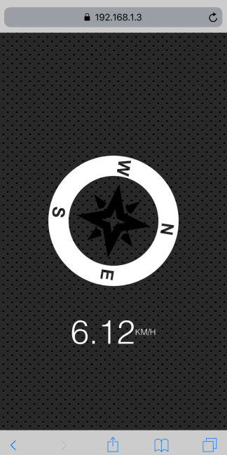

# Geolocation based Speedometer and Compass
* To start your own server: `npm install` to install all dependencides that includes `browser-sync`
* Then `npm start` to start the local server
* Open an iPhone simulator
* Set to `Debug > Location > Freeway Drive`
* Open `Safari` on the simulator and go to the https external url (e.g. `https://192.168.1.3:3000`)
* See how the compass *detects* the *fake* freeway movement

## Demo
